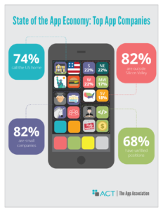

Title: APPLICATION ECONOMY – A WORLD WHERE CHANGE IS YOUR BIGGEST OPPORTUNITY
Date: 2017-05-24 10:00
Category: 社會人士
Tags: economy, STEM, tech-future
Author: CandiRai

<http://actonline.org/wp-content/uploads/App_Assoc_TPP_paper.pdf>

In existence less than a decade, the mobile app industry has experienced explosive growth alongside the rise of smartphones. As the most rapidly adopted technology in human history, these devices have revolutionized the software industry.

The App Association’s 2016 State of the App Economy report provides information and statistics on this innovative industry that continues to grow while creating jobs and revolutionizing how consumers work, play, and manage their health.

<!-- PELICAN_END_SUMMARY -->

